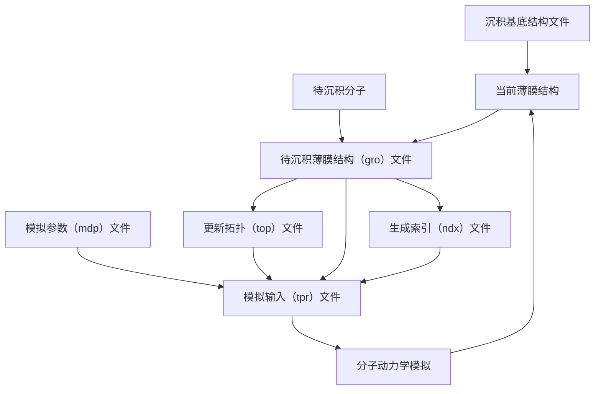

分子动力学模拟在有机发光二极管（OLED）薄膜研究中具有重要作用，研究人员可以通过模拟预测材料的分子排列、相互作用以及电荷、能量传输过程，为优化OLED材料的设计和改善器件性能提供了理论支持。
<!--more-->
其中，模拟真空沉积过程的非平衡分子动力学模拟方法可以有效地模拟真实沉积工艺的特征，预测真空蒸镀薄膜的形态。[^ref1][^ref2]

[^ref1]:[Ratcliff, L. E.;  Grisanti, L.;  Genovese, L.;  Deutsch, T.;  Neumann, T.;  Danilov, D.;  Wenzel, W.;  Beljonne, D.; Cornil, J., Toward Fast and Accurate Evaluation of Charge On-Site Energies and Transfer Integrals in Supramolecular Architectures Using Linear Constrained Density Functional Theory (CDFT)-Based Methods. Journal of Chemical Theory and Computation 2015, 11 (5), 2077-2086.](https://doi.org/10.1021/acs.jctc.5b00057)
[^ref2]:[Tonnelé, C.;  Stroet, M.;  Caron, B.;  Clulow, A. J.;  Nagiri, R. C. R.;  Malde, A. K.;  Burn, P. L.;  Gentle, I. R.;  Mark, A. E.; Powell, B. J., Elucidating the Spatial Arrangement of Emitter Molecules in Organic Light-Emitting Diode Films. Angewandte Chemie International Edition 2017, 56 (29), 8402-8406.](https://doi.org/10.1002/anie.201610727)
<style>
	.markdown-theme {
		max-width: 900px!important;
	}
	#toleranceTable {
		width: 100%;
		display: table;
		border: 2px #ccc solid;
	}
	#legendTable {
		display: table;
		width: 500px;
		table-layout: fixed;
		border: 2px #ccc solid;
		margin: 0 auto;
	}
	th, td {
		text-align: center;
	}
	th.safe, td.safe {
		background-color: #99cc3333;
	}
	th.warn, td.warn {
		background-color: #ffcc0033;
	}
	th.danger, td.danger {
		background-color: #dd330022;
	}
</style>
GROMACS（**GRO**ningen **MA**chine for **C**hemical **S**imulations）是开源免费的分子动力学模拟程序包，起初由荷兰格罗宁根大学生物化学系开发，目前由来自世界各地的大学和研究机构维护。本文将以**主体：客体二元掺杂薄膜**为例，介绍在Linux服务器上使用GROMACS对OLED薄膜进行分子动力学真空沉积模拟的方法。

## 实现思路与细节

主程序使用Bash编写，流程如下图，生成待沉积分子的脚本使用Python编写。



### 待沉积分子的选取

对于掺杂薄膜体系，生成下一个待沉积分子的方式主要有两种。第一种是通过随机数的方式动态地选择下一个分子的种类，对于由摩尔浓度分别为 $p$ 和 $(1-p)$ 的 A 和 B 两种分子共同组成的体系，每轮取一个随机数 $r\in[0,1)$，若 $r<p$ 则选下一个分子为 A 分子，否则为 B 分子。此种模拟方式相当于伯努利过程，在模拟 $N$ 轮过后，A 分子的数量 $X_\mathrm{A}$ 为二项分布 $X_\mathrm{A}\sim\mathrm{Bin}(N,p)$，最终得到的结构中 A 分子的实际摩尔浓度 $n_\mathrm{A}$ 的数学期望为 $p$。

但是此种模拟方式最终得到的结构中 $n_\mathrm{A}$ 并不能精确保证为 $p$。其方差为 $p(1-p)/N$，可以看到随着总分子数 $N$ 的增加 $n_\mathrm{A}$ 呈现减小趋势。但在实际操作中，我们往往更关心 $n_\mathrm{A}$ 偏离期望值 $p$ 的相对误差 $\displaystyle\frac{n_\mathrm{A}-p}{p}$，可以证明：

$$E(\frac{n_\mathrm{A}-p}{p})=0\quad\quad D(\frac{n_\mathrm{A}-p}{p})=\frac{1-p}{Np}$$

在总分子数固定的条件下，相对误差的方差随着 $p$ 的减小而迅速增大，因此如果沉积相同的分子数，$(1-p)/p$ 偏离 $1$ 的体系会相较于靠近 $1$ 的体系更难获得期望的摩尔浓度。下图展示了当 $p$ 分别为 $0.5$ 和 $0.1$ 时，在 $N=1000$ 条件下多次模拟的结果。


可见较小的 $p$ 带来的模拟结果的不确定性是巨大的，对于摩尔掺杂浓度为 $10\%$ 的体系，如果只沉积 $1000$ 个分子，则有相当大的概率得到相对误差超过 $10\%$ 的结果，如果具有较小摩尔浓度分子的分子量也较小，则质量浓度的误差还会大于 $10\%$。提高总分子数 $N$ 可以起到减小方差的效果，由于一般的模拟中 $N$ 均较大，二项分布 $\mathrm{Bin}(N,p)$ 可以近似为 $\mu=Np,\ \sigma^2=Np(1-p)$ 的正态分布，因此相对误差也可以近似为 $\displaystyle\mu=0,\ \sigma^2=\frac{1-p}{Np}$ 的正态分布。若希望 $3\sigma\leq\mathrm{Tol.}$，可以推导出总分子数需要满足的条件为：

$$N\geq\frac{9(1-p)}{p(\mathrm{Tol.}^2)}$$

$N$ 会随着误差限的收紧和 $p$ 的减小而迅速增大，直到超出计算能力的上限，下表列出了不同掺杂比例的体系在不同的容差下所需的 $N$，可以看到小于 $0.01$ 的 $p$ 以及小于 $1\%$ 的容差所需要的 $N$ 都超出了一般计算能力的限制。

<table id="legendTable">
	<tbody><tr>
		<th class="safe">Safe</th>
		<th class="warn">Warn</th>
		<th class="danger">It's FUTILE</th>
	</tr></tbody>
</table>
<table id="toleranceTable">
	<tbody>
		<tr>
			<th>Tolerance ($3\sigma$)</th>
			<th>$p=0.005$</th>
			<th>$p=0.01$</th>
			<th>$p=0.05$</th>
			<th>$p=0.1$</th>
			<th>$p=0.2$</th>
			<th>$p=0.3$</th>
			<th>$p=0.4$</th>
			<th>$p=0.5$</th>
		</tr>
		<tr>
			<th>Are you a billionaire?<br> ($1\%$)</th>
			<td class="danger">$10^{7.25}$</td>
			<td class="danger">$10^{6.95}$</td>
			<td class="danger">$10^{6.23}$</td>
			<td class="danger">$10^{5.91}$</td>
			<td class="danger">$10^{5.56}$</td>
			<td class="danger">$10^{5.32}$</td>
			<td class="danger">$10^{5.13}$</td>
			<td class="danger">$10^{4.95}$</td>
		</tr>
		<tr>
			<th>Tight<br> ($5\%$)</th>
			<td class="danger">$10^{5.86}$</td>
			<td class="danger">$10^{5.55}$</td>
			<td class="danger">$10^{4.84}$</td>
			<td class="danger">$10^{4.51}$</td>
			<td class="danger">$10^{4.16}$</td>
			<td class="warn">$8400$</td>
			<td class="warn">$5400$</td>
			<td class="safe">$3600$</td>
		</tr>
		<tr>
			<th>Default<br> ($10\%$)</th>
			<td class="danger">$10^{5.25}$</td>
			<td class="danger">$10^{4.95}$</td>
			<td class="danger">$10^{4.23}$</td>
			<td class="warn">$8100$</td>
			<td class="safe">$3600$</td>
			<td class="safe">$2100$</td>
			<td class="safe">$1350$</td>
			<td class="safe">$900$</td>
		</tr>
		<tr>
			<th>Loose<br> ($20\%$)</th>
			<td class="danger">$10^{4.65}$</td>
			<td class="danger">$10^{4.35}$</td>
			<td class="warn">$4275$</td>
			<td class="safe">$2025$</td>
			<td class="safe">$900$</td>
			<td class="safe">$525$</td>
			<td class="safe">$338$</td>
			<td class="safe">$225$</td>
		</tr>
		<tr>
			<th>Do you feel lucky?<br> ($50\%$)</th>
			<td class="danger">$7164$</td>
			<td class="warn">$3564$</td>
			<td class="warn">$684$</td>
			<td class="warn">$324$</td>
			<td class="warn">$144$</td>
			<td class="warn">$84$</td>
			<td class="warn">$54$</td>
			<td class="warn">$36$</td>
		</tr>
	</tbody>
</table>

为了避免获得大幅偏离预期的模拟结果，可以使用第二种选取待沉积分子的方式，依照摩尔浓度预先指定一个沉积分子种类的序列 $\{f_i\}_{i=1}^N,\ f_i\in\{\mathrm{A},\mathrm{B}\}$，在第 $i$ 轮选取 $f_i$ 作为待沉积分子。这种选取方法优势在于可以精确获得所需的分子数，并且当某种分子个数较少时，还可以按需调整每个分子之间的间隔，实现近似的均匀分布。利用Python可以按需生成序列文件，代码如下。

```python
import numpy as np
import random

def main(NUM):
	flg = False
	total_num = sum(NUM)
	process = 0
	while (process < max_cycle and not flg):
	    index_list = []
	    sequence = list(range(total_num))
	    pool = list(range(total_num))
	    for i in range(len(NUM)): 
	        index_list = random.sample(pool, NUM[i])
	        for j in index_list:
	            sequence[j] = i+1
	        pool = [index for index in pool if index not in index_list]

        sequence = np.array(sequence)

	    if (False): # 可按需改写为其他条件
	        flg=False
	    else:
	        flg=True
	    process+=1
	    if (process % 100 == 0):
	        print(process)

if __name__ == "__main__":
	NUM = [150,2850] # 每种分子的数量
	max_cycle = 1000 # 最大迭代轮数
	sequence = main(NUM, max_cycle)
	np.savetxt('sequence.txt', sequence, fmt='%d')
```

运行此代码将生成一个文本文件，每行一个数据（0或1），分别代表两种分子，在进行沉积时每轮读取该文本文件的对应行实现按预定序列进行沉积。

### 向gro文件中插入新分子坐标与速度

当选取好待插入的分子后，可通过 `np.random.random()` 和 `Rotation.random().apply()` 将分子平移到随机位置并进行随机旋转。由于gro文件中的分子顺序必须与top文件的定义相对应，因此需要在主程序中维护一个变量用于记录分隔A分子和B分子的行号，每次在该行之前插入一个分子都需要修改该变量。