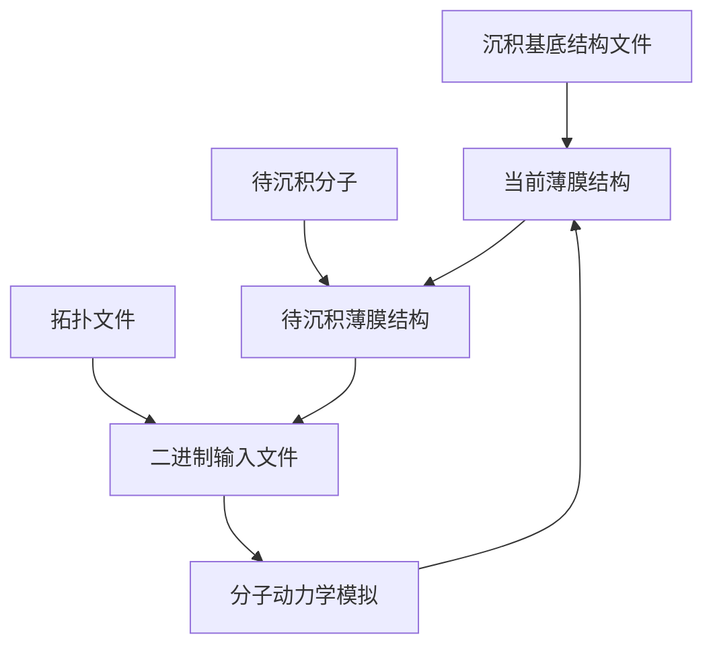

分子动力学模拟在有机发光二极管（OLED）薄膜研究中具有重要作用，研究人员可以通过模拟预测材料的分子排列、相互作用以及电荷、能量传输过程，为优化OLED材料的设计和改善器件性能提供了理论支持。
<!--more-->
其中，模拟真空沉积过程的非平衡分子动力学模拟方法可以有效地模拟真实沉积工艺的特征，预测真空蒸镀薄膜的形态。[^ref1][^ref2]

[^ref1]:[Ratcliff, L. E.;  Grisanti, L.;  Genovese, L.;  Deutsch, T.;  Neumann, T.;  Danilov, D.;  Wenzel, W.;  Beljonne, D.; Cornil, J., Toward Fast and Accurate Evaluation of Charge On-Site Energies and Transfer Integrals in Supramolecular Architectures Using Linear Constrained Density Functional Theory (CDFT)-Based Methods. Journal of Chemical Theory and Computation 2015, 11 (5), 2077-2086.](https://doi.org/10.1021/acs.jctc.5b00057)
[^ref2]:[Tonnelé, C.;  Stroet, M.;  Caron, B.;  Clulow, A. J.;  Nagiri, R. C. R.;  Malde, A. K.;  Burn, P. L.;  Gentle, I. R.;  Mark, A. E.; Powell, B. J., Elucidating the Spatial Arrangement of Emitter Molecules in Organic Light-Emitting Diode Films. Angewandte Chemie International Edition 2017, 56 (29), 8402-8406.](https://doi.org/10.1002/anie.201610727)

GROMACS（**GRO**ningen **MA**chine for **C**hemical **S**imulations）是开源免费的分子动力学模拟程序包，起初由荷兰格罗宁根大学生物化学系开发，目前由来自世界各地的大学和研究机构维护。本文将以主体：客体二元掺杂薄膜为例，介绍在Linux服务器上使用GROMACS对OLED薄膜进行分子动力学真空沉积模拟的方法。

## 实现思路与细节

主程序使用Bash编写，生成待沉积分子的脚本使用Python编写，代码可从[此处]()下载

<table id="toleranceTable">
	<tbody>
		<tr>
			<th>Tolerance ($3\sigma$)</th>
			<th>$p=0.005$</th>
			<th>$p=0.01$</th>
			<th>$p=0.05$</th>
			<th>$p=0.1$</th>
			<th>$p=0.2$</th>
			<th>$p=0.3$</th>
			<th>$p=0.4$</th>
			<th>$p=0.5$</th>
		</tr>
		<tr>
			<th>Are you a billionaire?  ($1\%$)</th>
			<td class="danger">$10^{7.25}$</td>
			<td class="danger">$10^{6.95}$</td>
			<td class="danger">$10^{6.23}$</td>
			<td class="danger">$10^{5.91}$</td>
			<td class="danger">$10^{5.56}$</td>
			<td class="danger">$10^{5.32}$</td>
			<td class="danger">$10^{5.13}$</td>
			<td class="danger">$10^{4.95}$</td>
		</tr>
		<tr>
			<th>Tight  ($5\%$)</th>
			<td class="danger">$10^{5.86}$</td>
			<td class="danger">$10^{5.55}$</td>
			<td class="danger">$10^{4.84}$</td>
			<td class="danger">$10^{4.51}$</td>
			<td class="danger">$10^{4.16}$</td>
			<td class="warn">$8400$</td>
			<td class="warn">$5400$</td>
			<td class="safe">$3600$</td>
		</tr>
		<tr>
			<th>Default  ($10\%$)</th>
			<td class="danger">$10^{5.25}$</td>
			<td class="danger">$10^{4.95}$</td>
			<td class="danger">$10^{4.23}$</td>
			<td class="warn">$8100$</td>
			<td class="safe">$3600$</td>
			<td class="safe">$2100$</td>
			<td class="safe">$1350$</td>
			<td class="safe">$900$</td>
		</tr>
		<tr>
			<th>Loose  ($20\%$)</th>
			<td class="danger">$10^{4.65}$</td>
			<td class="danger">$10^{4.35}$</td>
			<td class="warn">$4275$</td>
			<td class="safe">$2025$</td>
			<td class="safe">$900$</td>
			<td class="safe">$525$</td>
			<td class="safe">$338$</td>
			<td class="safe">$225$</td>
		</tr>
		<tr>
			<th>Do you feel lucky?  ($50\%$)</th>
			<td class="danger">7164</td>
			<td class="warn">$3564$</td>
			<td class="warn">$684$</td>
			<td class="warn">$324$</td>
			<td class="warn">$144$</td>
			<td class="warn">$84$</td>
			<td class="warn">$54$</td>
			<td class="warn">$36$</td>
		</tr>
	</tbody>
</table>